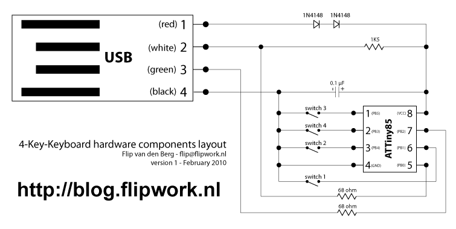

# Attiny85Keyboard

A tiny keyboard to send some shortcuts with some buttons.

The initial idea was to mute/unmute myself on Zoom with a button, hahaha!

## Schematic

## Credits

Inspired by: http://blog.flipwork.nl/?x=entry:entry100224-003937;comments:1

USB driver: 
- https://www.obdev.at/products/vusb/index.html
- or https://github.com/digistump/DigisparkArduinoIntegration/tree/master/libraries/DigisparkKeyboard
